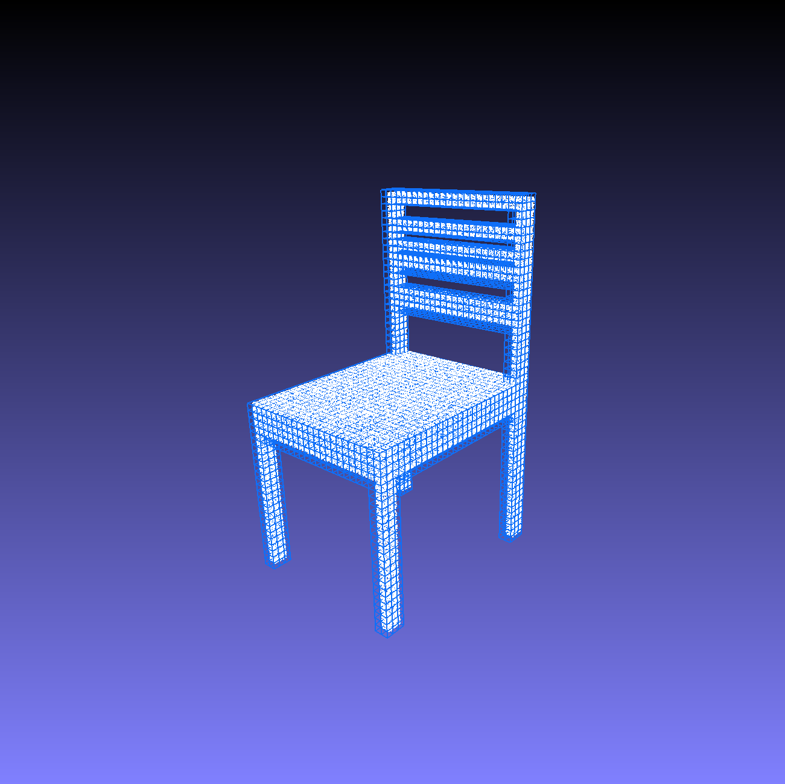
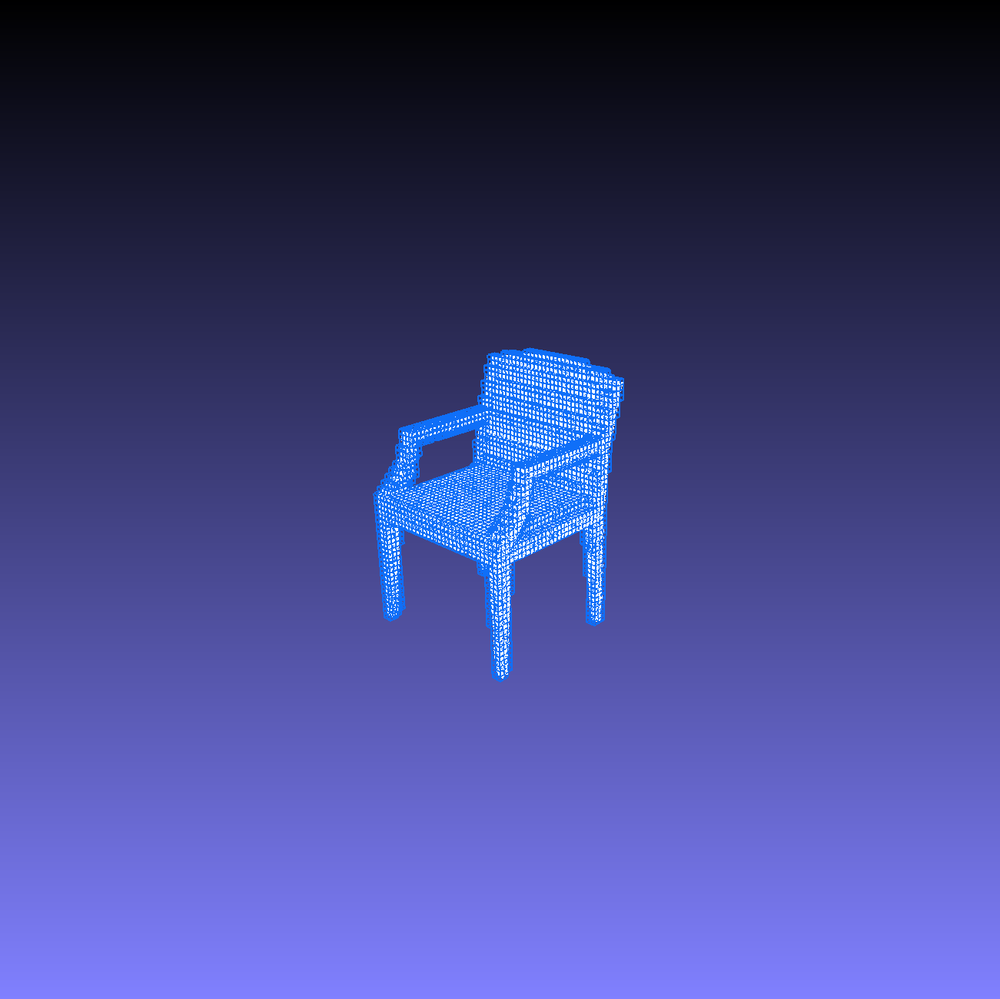
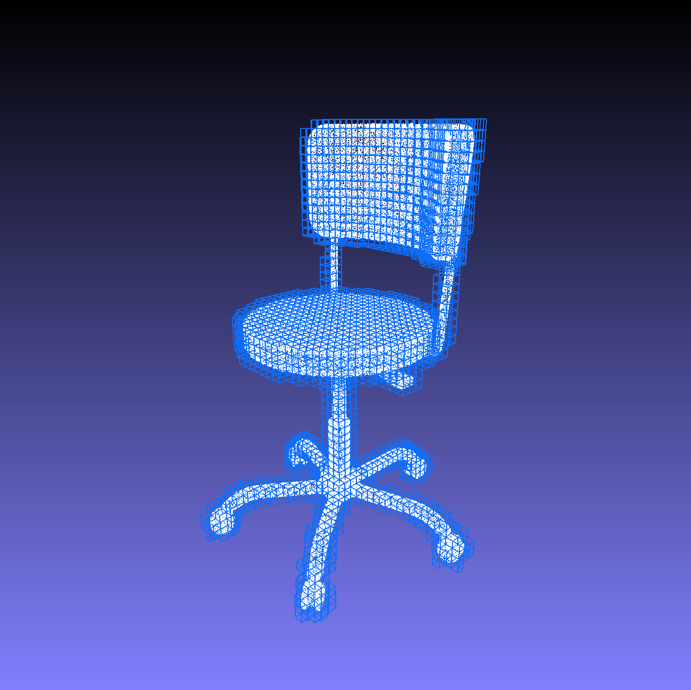
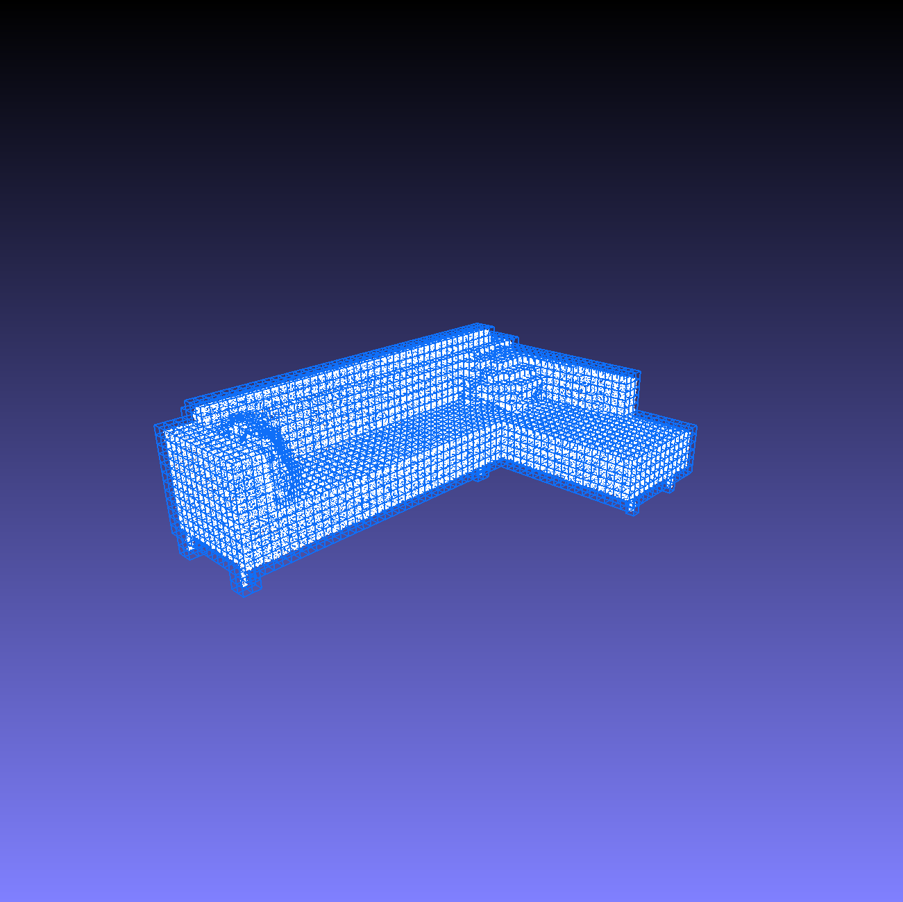
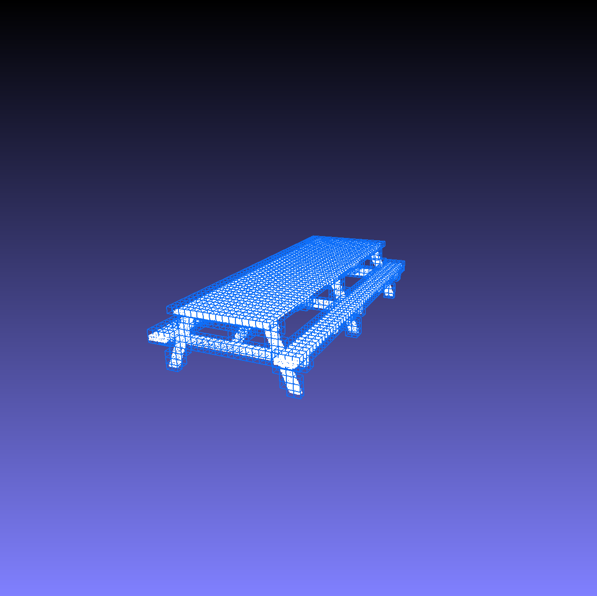

# Surface Voxelization

Voxelize the surface of a mesh.

## Dependencies
Minimal dependencies:
- numpy
- trimesh

## Usage

```
python voxelize_surface.py example/chair_0007.off --output_folder output --resolution 30 30 30 --sampling 10000
```

The optional parameters are:
- **output_folder** (*string*): folder where the result is saved
- **resolution** (*list*): the resolution of the grid ```[res_x, res_y, res_z]```
- **sampling** (*int*): number of points sampled on the mesh surface before voxelization


## Results

<span style="color:white"></span>|<span style="color:white"></span>|<span style="color:white"></span>
:-------------------------:|:-------------------------:|:-------------------------:
  |  | 
  |  | 
  |  | 


